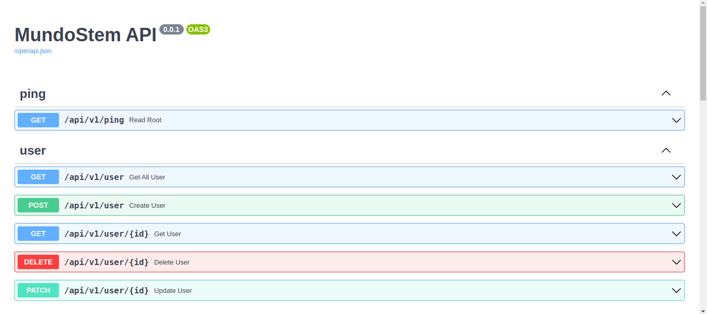

# 🌐 MundoStem API - Execution Instructions

This document provides instructions on how to run the **MundoStem API** application. The project uses **PostgreSQL** as the database and is divided into two parts: the backend and the frontend. You can find the frontend in the [MundoStem Frontend Repository](https://github.com/DavidOlmos03/mundoStem/tree/main).

---

## 🚀 Running the Application

This setup uses **Docker** to manage all services, including the database and the backend.

### 🛠 Prerequisites
- 🐋 [Docker](https://www.docker.com/) and Docker Compose installed.
- 🐍 [Poetry](https://python-poetry.org/) installed for dependency management.

---

### ⚙️ Steps to Run

1. **🌐 Create the network `mundostem`:**
   ```bash
   docker network create mundostem
   ```

2. 🔧 Start the services with Docker Compose:
   ```bash
   docker compose -f ./docker/docker-compose.dev.yml up --build
   ```
3. 🌍 Start the application:
   ```bash
   localhost:8002/docs
---

## 📚 Endpoints

Once the backend is running, the available endpoints can be explored through Swagger. To access the interactive documentation of the endpoints, open the corresponding URL in your browser.



---

## 📝 Additional Notes
- 🐋 🐍 Make sure you have Docker, Docker Compose, and Poetry installed correctly on your system.
- 🔑 The environment variables configuration is key to ensure that the services communicate correctly.
- 📖 The correction of any doubt or issue, consult the project documentation or contact the development team.